# 90 Days of Building Agentic AI — From Python Foundations to Production AI Agents

> A project-first, hands-on roadmap for going from **developer foundations** to **building, evaluating, securing, and deploying AI agents**, documented in public.


---

## Table of Contents

1. [About This Repository](#1-about-this-repository)
2. [What "Job-Ready" Means](#2-what-job-ready-means)
3. [Learning Philosophy and Method](#3-learning-philosophy-and-method)
4. [The 11-Stage Roadmap](#4-the-11-stage-roadmap)
5. [Detailed Syllabus (Stage 0 to Stage 10)](#5-detailed-syllabus)
6. [Project Plan (20 Projects)](#6-project-plan)
7. [Requirements for Every Major Project](#7-requirements-for-every-major-project)
8. [90-Day Schedule](#8-90-day-schedule)
9. [Day-by-Day Checklist](#9-day-by-day-checklist)
10. [Daily Routine](#10-daily-routine)
11. [Weekly Review](#11-weekly-review)
12. [Important Mental Models](#12-important-mental-models)
13. [Technology Stack](#13-technology-stack)
14. [Repository Structure](#14-repository-structure)
15. [Learning Rules](#15-learning-rules)
16. [Portfolio Checklist](#16-portfolio-checklist)
17. [Interview Preparation](#17-interview-preparation)
18. [Progress Tracker](#18-progress-tracker)
19. [Current Progress](#19-current-progress)
20. [Next Milestone](#20-next-milestone)
21. [Lessons Learned](#21-lessons-learned)
22. [Projects Completed](#22-projects-completed)
23. [A Note on Consistency](#23-a-note-on-consistency)

---

## 1. About This Repository

This repository documents my **90-Day Agentic AI Learning Journey**. I am starting from **Stage 0 (Developer Foundation)** and working toward the skills needed for **Agentic AI / AI Engineer** roles.

The goal is **not** to finish tutorials. The goal is to:

- Build strong Python and backend fundamentals
- Understand how LLMs actually work as software components
- Build AI applications, then AI agents
- Understand agent architecture (loops, state, memory, planning)
- Build RAG systems, tool-using agents, and multi-agent systems
- Build and deploy production-oriented AI systems
- Create a strong, honest GitHub portfolio
- Prepare for technical interviews

> **Realistic expectations:** 90 days is an ambitious timeline for this much material, especially starting from the foundations. The schedule includes buffer days, and the later "final projects" are treated as an extension track. If a topic needs more time, I will take it. **Depth beats speed.** Completing this roadmap does not guarantee a job. It is designed to build a strong practical portfolio and job-relevant skills.

### How the roadmap fits together

```mermaid
flowchart LR
    S0[Stage 0<br/>Developer Foundation] --> S1[Stage 1<br/>LLM Fundamentals]
    S1 --> S2[Stage 2<br/>Structured Outputs]
    S2 --> S3[Stage 3<br/>Tool Calling]
    S3 --> S4[Stage 4<br/>RAG]
    S4 --> S5[Stage 5<br/>Agent + RAG]
    S5 --> S6[Stage 6<br/>Agent Architecture]
    S6 --> S7[Stage 7<br/>Agent Frameworks]
    S7 --> S8[Stage 8<br/>Multi-Agent]
    S8 --> S9[Stage 9<br/>Coding Agents]
    S9 --> S10[Stage 10<br/>Production AI]
```



---

## 2. What "Job-Ready" Means

"Job-ready" here means I can demonstrate **practical, explainable skills**, not just that I have watched courses. By the end of the roadmap, I want to be able to:

- [ ] Write clean, tested Python
- [ ] Build FastAPI APIs
- [ ] Work with REST APIs
- [ ] Work with databases
- [ ] Call LLM APIs reliably
- [ ] Build RAG systems
- [ ] Build tool-using agents
- [ ] Build stateful agents
- [ ] Build multi-agent systems
- [ ] Use an agent framework (LangGraph) and know when *not* to
- [ ] Build production-oriented AI systems
- [ ] Debug AI applications
- [ ] Evaluate AI systems with real test datasets
- [ ] Deploy AI applications
- [ ] Explain my architecture decisions in interviews
- [ ] Discuss security and reliability (prompt injection, permissions, data leakage)

**What this roadmap does and does not promise**

| It is designed to | It does NOT |
| --- | --- |
| Build a strong practical portfolio | Guarantee employment |
| Develop job-relevant skills | Replace real-world production experience |
| Create explainable, demo-able projects | Make me an expert in 90 days |

---

## 3. Learning Philosophy and Method

```text
20% Learning
80% Building
```

For every major concept:

```text
Learn
↓
Understand
↓
Write Code
↓
Exercise
↓
Build Mini Project
↓
Debug
↓
Build Real Project
↓
Review
↓
Explain Without Notes
↓
Interview Questions
```

### What this looks like in practice

| Step | What I do |
| --- | --- |
| **Learn** | Read docs or watch a focused lesson (max ~30 min) |
| **Understand** | Write the concept in my own words in `notes/` |
| **Write Code** | Type a small working example from scratch |
| **Exercise** | Solve 3 to 5 small problems on the concept |
| **Build Mini Project** | Combine the concept with previous ones |
| **Debug** | Break it on purpose, fix my own errors first |
| **Build Real Project** | Apply it to the current stage project |
| **Review** | Clean up, refactor, add tests |
| **Explain Without Notes** | Explain it aloud or in writing, no notes |
| **Interview Questions** | Answer 2 to 3 related interview questions |

---

## 4. The 11-Stage Roadmap

| Stage | Name | Days | Main Project |
| --- | --- | --- | --- |
| 0 | Developer Foundation | 1–33 | Projects 1–5 |
| 1 | LLM Fundamentals | 34–39 | Project 6: AI Chat API |
| 2 | Structured Outputs | 40–45 | Project 7: AI Resume Analyzer |
| 3 | Tool Calling | 46–52 | Project 8: Personal AI Assistant |
| 4 | RAG | 53–60 | Project 9: Document RAG Chatbot |
| 5 | Agent + RAG | 61–65 | Project 10: Company Knowledge Agent |
| 6 | Agent Architecture | 66–70 | Project 11: Web Research Agent |
| 7 | Agent Frameworks | 71–75 | Project 12: Framework-Based Research Agent |
| 8 | Advanced / Multi-Agent | 76–80 | Project 13: Multi-Agent Research System |
| 9 | Coding Agents | 81–85 | Project 14: AI Coding Agent |
| 10 | Production AI + Portfolio + Interviews | 86–90 | Project 15 (capstone) + polish |

Progression: **beginner → intermediate → advanced → job-ready**.

---

## 5. Detailed Syllabus

### Stage 0 — Developer Foundation

This stage builds the programming and backend foundation that every later stage depends on. Agents are software: if the Python, HTTP, and API basics are weak, everything after this becomes guesswork.

#### Python Fundamentals

- Variables, data types, strings, numbers, booleans
- Input/output, operators
- `if` / `elif` / `else`
- `for` loops, `while` loops, `break`, `continue`
- Lists, tuples, sets, dictionaries
- Functions, parameters, arguments, return values, default arguments
- `*args`, `**kwargs`
- Scope, lambda functions
- List/dict comprehensions, `map` / `filter`
- Exception handling
- Modules, packages

#### Python OOP

- Classes, objects, attributes, methods
- `__init__`
- Inheritance, composition, encapsulation

#### Professional Python

- Virtual environments, `pip`, `requirements.txt`, `pyproject.toml`
- Environment variables
- Type hints, dataclasses
- Logging
- Testing
- Project structure
- Git and GitHub

#### Async Python

- `async`, `await`, `asyncio`, asynchronous programming
- **Why async matters for AI applications:** LLM and tool calls are slow network operations. Async lets one server handle many of them concurrently instead of blocking.

#### Web and APIs

- Internet basics, HTTP, request, response, URL, endpoint
- `GET`, `POST`, `PUT`, `PATCH`, `DELETE`
- Headers, body, JSON, status codes
- REST APIs
- Authentication, API keys

#### FastAPI

- Routes, path parameters, query parameters, request bodies
- Pydantic, validation, response models
- `HTTPException`, status codes
- Dependencies, middleware
- Authentication
- Async endpoints
- Database integration

**Stage 0 Projects**

1. Python CLI Calculator
2. CLI Todo App
3. Expense Tracker
4. Weather / API CLI
5. Production FastAPI Todo API

---

### Stage 1 — LLM Fundamentals

- What is an LLM?
- How LLM applications work
- LLM APIs, API requests/responses
- System messages, user messages, assistant messages
- Prompting, context, conversation history
- Tokens, context windows
- Model parameters
- Streaming
- API error handling, retries
- Cost awareness
- Environment variables, API key security

**Project 6 — AI Chat API** (Python + FastAPI + an LLM API): chat, streaming, conversation history, system prompts, error handling, authentication.

---

### Stage 2 — Structured Outputs

- Why plain text is difficult for software
- JSON outputs, structured generation, schemas
- Pydantic models, validation
- Reliable AI outputs
- Extracting structured information
- Handling invalid output (validate, retry, repair, fail safely)

**Project 7 — AI Resume Analyzer:** resume upload, parsing, skill / experience / education extraction, structured JSON output, Pydantic validation, API endpoint.

---

### Stage 3 — Tool Calling

- What tools are, and why agents need them
- Function calling
- Tool schemas, tool arguments
- Tool execution, tool results
- Tool selection, multiple tool calls
- Tool errors
- Tool permissions
- Awareness of the Model Context Protocol (MCP) as an emerging standard for exposing tools

Mental model:

```text
User
↓
LLM
↓
Decide
↓
Tool
↓
Tool Result
↓
LLM
↓
Final Answer
```

```text
Agent = LLM + Tools + Loop + State
```

**Project 8 — Personal AI Assistant:** calculator, weather, web search, file reader, other useful APIs.

---

### Stage 4 — RAG (Retrieval-Augmented Generation)

- What is RAG, and why it is needed
- Embeddings
- Documents, document loading
- Chunking, metadata
- Vector databases, similarity search
- Retrieval, reranking
- Context construction
- Citations
- Hallucination reduction
- Retrieval evaluation

```text
Documents
↓
Chunking
↓
Embeddings
↓
Vector Database
↓
Retrieval
↓
Relevant Context
↓
LLM
↓
Answer
```

**Project 9 — Document RAG Chatbot:** PDF upload, document processing, vector database, semantic search, question answering, citations, multiple documents.

---

### Stage 5 — Agent + RAG

- Agentic RAG
- Agent deciding **when** to retrieve
- Retrieval tools, search tools
- RAG + tool calling
- Conversation memory
- Citations, source verification

**Project 10 — Company Knowledge Agent:** company documents, RAG, tool calling, agent reasoning, conversation memory, citations, authentication.

---

### Stage 6 — Agent Architecture

- Agent loop
- State
- Short-term memory, long-term memory
- Planning, task decomposition
- Routing, reflection
- Retry strategies, error handling
- State transitions
- Human-in-the-loop
- Guardrails, permissions

```text
Fixed Workflow    →  Steps are predefined in code. Predictable, cheap, easy to test.
Agentic Workflow  →  The LLM decides the next step at runtime. Flexible, harder to control and test.
```

> Rule of thumb: use the **simplest** approach that solves the problem. Many "agent" problems are better solved by a fixed workflow.

**Project 11 — Web Research Agent**

```text
User
↓
Planner
↓
Search
↓
Read Sources
↓
Extract Information
↓
Analyze
↓
Write Report
↓
Citations
```

---

### Stage 7 — Agent Frameworks

One framework, learned deeply: **LangGraph** (chosen because it exposes state, nodes, edges, persistence, and human-in-the-loop explicitly, which maps directly to the concepts from Stage 6).

- Agent creation, tools
- State, nodes, edges
- Conditional routing
- Persistence, checkpoints
- Human-in-the-loop
- Workflows, agent loops
- Streaming, debugging
- **Where frameworks help vs. where plain Python is better**

**Project 12 — Framework-Based Research Agent:** an advanced version of Project 11 with persistent state, tool routing, checkpoints, human approval, and error recovery.

---

### Stage 8 — Advanced / Multi-Agent Systems

- Multi-agent architecture, agent specialization
- Manager, worker, researcher, writer, reviewer agents
- Agent communication, shared state
- Delegation, coordination
- Parallel execution
- Human-in-the-loop

```text
Manager
├── Researcher
├── Writer
└── Reviewer
```

**Project 13 — Multi-Agent Research System:** understand the task, plan research, delegate, research, write, review, improve, produce final output.

---

### Stage 9 — Coding Agents

- Reading repositories, understanding code
- File operations
- Code generation, code modification
- Running tests, reading errors
- Debugging, iterative coding
- Sandboxing, tool permissions, security

```text
User Request
↓
Planner
↓
Read Repository
↓
Understand Code
↓
Modify Code
↓
Run Tests
↓
Read Errors
↓
Fix
↓
Run Tests Again
↓
Final Result
```

**Project 14 — AI Coding Agent:** a safe coding agent that works inside a sandboxed repository.

---

### Stage 10 — Production AI

```text
Production AI = Functionality + Reliability + Security + Evaluation + Observability
```

| Area | Topics |
| --- | --- |
| **Reliability** | Retries, timeouts, fallbacks, validation, error handling |
| **Security** | Prompt injection, tool permissions, data leakage, authentication, authorization, sandboxing, secrets management |
| **Observability** | Agent traces, tool calls, latency, token usage, costs, failures, logs |
| **Evaluation** | Test datasets, evaluation criteria, accuracy, tool selection accuracy, retrieval quality, agent success rate, regression testing |
| **Deployment** | Docker, environment variables, cloud deployment, production APIs, database, monitoring |

**Final Projects:** 15 Customer Support Agent · 16 SQL Data Analyst Agent · 17 AI Email Agent · 18 E-commerce Agent · 19 Autonomous Research Platform · 20 Production Agent Platform

---

## 6. Project Plan

The roadmap targets **at least 15 substantial portfolio projects**. Projects 1–5 are foundation projects (smaller but still portfolio-worthy). Projects 6–15 are the core agentic portfolio. Projects 16–20 are the **extension track** after Day 90.

| # | Project | Stage | Days | Key Skills Demonstrated |
| --- | --- | --- | --- | --- |
| 1 | Python CLI Calculator | 0 | 7 | Functions, control flow, error handling |
| 2 | CLI Todo App | 0 | 13–14 | Data structures, file I/O, modules |
| 3 | Expense Tracker | 0 | 20–21 | OOP, dataclasses, persistence, tests |
| 4 | Weather / API CLI | 0 | 24 | HTTP, JSON, API keys, error handling |
| 5 | Production FastAPI Todo API | 0 | 30–32 | FastAPI, Pydantic, DB, auth, Docker |
| 6 | AI Chat API | 1 | 37–39 | LLM APIs, streaming, history, auth |
| 7 | AI Resume Analyzer | 2 | 42–44 | Structured outputs, validation, file upload |
| 8 | Personal AI Assistant | 3 | 49–52 | Tool calling, agent loop |
| 9 | Document RAG Chatbot | 4 | 57–60 | Embeddings, vector DB, retrieval, citations |
| 10 | Company Knowledge Agent | 5 | 63–65 | Agentic RAG, memory, auth |
| 11 | Web Research Agent | 6 | 69–70 | Planning, state, multi-step workflows |
| 12 | Framework-Based Research Agent | 7 | 74–75 | LangGraph, checkpoints, human approval |
| 13 | Multi-Agent Research System | 8 | 78–80 | Delegation, shared state, coordination |
| 14 | AI Coding Agent | 9 | 84–85 | Sandboxing, tool safety, test-driven loops |
| 15 | Customer Support Agent (capstone) | 10 | 88–89 | RAG + tools + guardrails + evals + deployment |
| 16 | SQL Data Analyst Agent | Ext. | After Day 90 | Text-to-SQL safety, read-only permissions |
| 17 | AI Email Agent | Ext. | After Day 90 | Integrations, human approval, privacy |
| 18 | E-commerce Agent | Ext. | After Day 90 | Domain tools, order/catalog workflows |
| 19 | Autonomous Research Platform | Ext. | After Day 90 | Long-running agents, queues, persistence |
| 20 | Production Agent Platform | Ext. | After Day 90 | Multi-tenant design, observability, evals |

---

## 7. Requirements for Every Major Project

Every major project (Project 5 onward) must include:

| Requirement | Description |
| --- | --- |
| **Problem statement** | What real problem does this solve, and for whom? |
| **Features** | Clear list of what it does (and does not do) |
| **Technologies** | The stack and why each piece was chosen |
| **Architecture** | Diagram (Mermaid or image) plus a short explanation |
| **API design** | Endpoints, request/response schemas |
| **Database** | Schema and why this database |
| **Authentication** | Where relevant (API keys, JWT) |
| **Error handling** | What fails, and how the system responds |
| **Testing** | Unit tests, plus evaluation cases for AI behavior |
| **README** | Setup, usage, architecture, limitations |
| **Docker** | `Dockerfile` (and `docker-compose.yml` if needed) |
| **Deployment** | Deployed link or documented deployment steps |
| **GitHub repository** | Clean commits, clear structure |
| **Demo** | Screenshots, GIF, or short video |
| **Interview questions** | Written Q&A about the project (see [Interview Preparation](#17-interview-preparation)) |

### Project README template

```markdown
# Project Name
One-sentence description.

## Problem
## Features
## Architecture
## Tech Stack
## Getting Started
## API Reference
## Testing and Evaluation
## Security Considerations
## Known Limitations
## What I Learned
## Interview Talking Points
```

---

## 8. 90-Day Schedule

The original outline was Days 1–30 for foundations. I adjusted it because Stage 0 covers a lot (Python, OOP, async, HTTP, FastAPI, databases, and five projects), so it runs to **Day 33**. Every week includes topics, learning goals, coding practice, project work, revision, and interview preparation.

### Phase Overview

| Phase | Days | Focus |
| --- | --- | --- |
| A | 1–33 | Developer Foundation |
| B | 34–45 | LLM Fundamentals + Structured Outputs |
| C | 46–60 | Tool Calling + RAG |
| D | 61–75 | Agent + RAG, Agent Architecture, Agent Frameworks |
| E | 76–85 | Multi-Agent + Coding Agents |
| F | 86–90 | Production + Portfolio + Interview Preparation |

### Weekly Table

| Week | Days | Topics | Project | Outcome |
| --- | --- | --- | --- | --- |
| 1 | 1–7 | Setup, variables, types, strings, conditionals, loops, lists, tuples, sets, dicts | Project 1: CLI Calculator | Comfortable writing basic Python programs |
| 2 | 8–14 | Functions, `*args`/`**kwargs`, scope, lambda, comprehensions, `map`/`filter`, exceptions, file I/O, modules | Project 2: CLI Todo App | Can structure a multi-function program with persistence |
| 3 | 15–21 | OOP, inheritance, composition, venv/pip/pyproject, type hints, dataclasses, logging, pytest, Git/GitHub | Project 3: Expense Tracker | Professional Python habits: typing, tests, Git |
| 4 | 22–28 | HTTP, REST, JSON, status codes, calling APIs, async, FastAPI basics, Pydantic, dependencies, auth | Project 4: Weather/API CLI | Can call APIs and build basic FastAPI endpoints |
| 5 | 29–35 | Databases, production FastAPI, Docker basics; LLM basics, roles, prompting, tokens | Project 5: Production FastAPI Todo API | A deployable backend; first LLM API calls |
| 6 | 36–42 | Streaming, retries, costs, key security; structured outputs, JSON schemas, Pydantic validation | Project 6: AI Chat API; start Project 7 | Working chat API; reliable structured output |
| 7 | 43–49 | Resume extraction, invalid-output handling; tool concepts, schemas, execution loop | Project 7 finish; start Project 8 | Validated extraction API; first tool-using agent |
| 8 | 50–56 | Multiple tools, tool errors, permissions; RAG concepts, embeddings, chunking, vector DB | Project 8 finish; start Project 9 | Assistant with tools; understand RAG pipeline |
| 9 | 57–63 | Retrieval, reranking, citations, RAG evaluation; agentic RAG, memory | Project 9 finish; start Project 10 | Working RAG chatbot; agent that decides when to retrieve |
| 10 | 64–70 | Auth, source verification; agent loop, state, planning, routing, reflection, guardrails | Project 10 finish; Project 11 | Knowledge agent; multi-step research agent in plain Python |
| 11 | 71–77 | LangGraph state, nodes, edges, routing, checkpoints, human-in-the-loop; multi-agent patterns | Project 12; start Project 13 | Stateful, resumable agent; multi-agent design skills |
| 12 | 78–84 | Delegation, shared state, parallel execution; repo reading, file ops, running tests, sandboxing | Project 13 finish; start Project 14 | Multi-agent system; coding agent foundations |
| 13 | 85–90 | Coding agent security; reliability, security, observability, evaluation, deployment; portfolio and mock interviews | Project 14 finish; Project 15 capstone | Production-minded portfolio and interview readiness |

---

## 9. Day-by-Day Checklist

Each day follows the [daily routine](#10-daily-routine). Tick the box only when I could **explain the topic without notes** and the code is committed.

<details>
<summary><b>Stage 0 — Developer Foundation (Days 1–33)</b></summary>

**Week 1: Python basics**

- [ ] **Day 1** — Environment setup (Python, VS Code, terminal, Git). Variables, data types
- [ ] **Day 2** — Strings, numbers, booleans, input/output, operators
- [ ] **Day 3** — Conditionals: `if` / `elif` / `else`
- [ ] **Day 4** — Loops: `for`, `while`, `break`, `continue`
- [ ] **Day 5** — Lists and tuples
- [ ] **Day 6** — Sets and dictionaries
- [ ] **Day 7** — **Project 1: CLI Calculator** + weekly review

**Week 2: Functions and structure**

- [ ] **Day 8** — Functions: parameters, arguments, return values, default arguments
- [ ] **Day 9** — `*args`, `**kwargs`, scope, lambda
- [ ] **Day 10** — List/dict comprehensions, `map`, `filter`
- [ ] **Day 11** — Exception handling, reading/writing files, JSON
- [ ] **Day 12** — Modules and packages
- [ ] **Day 13** — **Project 2: CLI Todo App** (build core features)
- [ ] **Day 14** — Project 2 (persistence, cleanup) + weekly review

**Week 3: OOP and professional Python**

- [ ] **Day 15** — OOP: classes, objects, attributes, methods, `__init__`
- [ ] **Day 16** — Inheritance, composition, encapsulation
- [ ] **Day 17** — Virtual environments, `pip`, `requirements.txt`, `pyproject.toml`, environment variables
- [ ] **Day 18** — Type hints, dataclasses
- [ ] **Day 19** — Logging, testing with `pytest`
- [ ] **Day 20** — **Project 3: Expense Tracker** (OOP, persistence, tests)
- [ ] **Day 21** — Project 3 finish, Git and GitHub workflow (branches, commits, PRs) + weekly review

**Week 4: Web, APIs, async, FastAPI**

- [ ] **Day 22** — Internet basics, HTTP, request/response, URL, endpoint, methods, headers, status codes, JSON, REST
- [ ] **Day 23** — Calling APIs from Python, authentication, API keys
- [ ] **Day 24** — **Project 4: Weather/API CLI**
- [ ] **Day 25** — Async Python: `async`, `await`, `asyncio`, concurrent requests, why async matters for AI
- [ ] **Day 26** — FastAPI basics: routes, path parameters, query parameters, request bodies
- [ ] **Day 27** — Pydantic, validation, response models, `HTTPException`, status codes
- [ ] **Day 28** — Dependencies, middleware, authentication, async endpoints + weekly review

**Week 5: Databases and production FastAPI**

- [ ] **Day 29** — Database integration (SQL basics, ORM, migrations)
- [ ] **Day 30** — **Project 5: Production FastAPI Todo API** (CRUD + database)
- [ ] **Day 31** — Project 5: authentication, validation, tests
- [ ] **Day 32** — Project 5: Docker, README, deployment
- [ ] **Day 33** — Stage 0 review, buffer day, mock interview on Python + FastAPI

</details>

<details>
<summary><b>Stage 1 — LLM Fundamentals (Days 34–39)</b></summary>

- [ ] **Day 34** — What is an LLM? How LLM apps work, LLM APIs, requests/responses, system/user/assistant messages
- [ ] **Day 35** — Prompting, context, conversation history, tokens, context windows, model parameters
- [ ] **Day 36** — Streaming, API error handling, retries, cost awareness, API key security
- [ ] **Day 37** — **Project 6: AI Chat API** (chat endpoint, conversation history, system prompts)
- [ ] **Day 38** — Project 6: streaming, error handling, authentication, tests
- [ ] **Day 39** — Project 6: Docker, README, deploy + review + weekly review

</details>

<details>
<summary><b>Stage 2 — Structured Outputs (Days 40–45)</b></summary>

- [ ] **Day 40** — Why plain text is hard for software, JSON outputs, schemas, structured generation
- [ ] **Day 41** — Pydantic models, validation, handling invalid output (retry, repair, fail safely)
- [ ] **Day 42** — **Project 7: AI Resume Analyzer** (upload and parsing)
- [ ] **Day 43** — Project 7: skill, experience, and education extraction with validated schemas
- [ ] **Day 44** — Project 7: API endpoint, tests, small evaluation set, README
- [ ] **Day 45** — Review, buffer, interview questions, weekly review

</details>

<details>
<summary><b>Stage 3 — Tool Calling (Days 46–52)</b></summary>

- [ ] **Day 46** — What tools are, why agents need them, function calling
- [ ] **Day 47** — Tool schemas, arguments, execution, results; the tool-calling loop
- [ ] **Day 48** — Multiple tool calls, tool selection, tool errors
- [ ] **Day 49** — Tool permissions; `Agent = LLM + Tools + Loop + State`; start **Project 8**
- [ ] **Day 50** — Project 8: calculator, weather, web search tools
- [ ] **Day 51** — Project 8: file reader tool, safety checks, tests
- [ ] **Day 52** — Project 8: finish, README, review + weekly review

</details>

<details>
<summary><b>Stage 4 — RAG (Days 53–60)</b></summary>

- [ ] **Day 53** — What is RAG, why it is needed, embeddings
- [ ] **Day 54** — Document loading, chunking strategies, metadata
- [ ] **Day 55** — Vector databases, similarity search
- [ ] **Day 56** — Retrieval, reranking, context construction
- [ ] **Day 57** — **Project 9: Document RAG Chatbot** (PDF upload and ingestion)
- [ ] **Day 58** — Project 9: question answering, citations, multiple documents
- [ ] **Day 59** — Hallucination reduction, retrieval evaluation (build a test set)
- [ ] **Day 60** — Project 9: finish, Docker, README + weekly review

</details>

<details>
<summary><b>Stage 5 — Agent + RAG (Days 61–65)</b></summary>

- [ ] **Day 61** — Agentic RAG, retrieval as a tool, agent deciding when to retrieve
- [ ] **Day 62** — Conversation memory, source verification, RAG + tool calling
- [ ] **Day 63** — **Project 10: Company Knowledge Agent** (build core)
- [ ] **Day 64** — Project 10: authentication, citations, tests
- [ ] **Day 65** — Project 10: finish, README, review

</details>

<details>
<summary><b>Stage 6 — Agent Architecture (Days 66–70)</b></summary>

- [ ] **Day 66** — Agent loop, state, short-term and long-term memory
- [ ] **Day 67** — Planning, task decomposition, routing, reflection
- [ ] **Day 68** — Retry strategies, error handling, state transitions, human-in-the-loop, guardrails, permissions
- [ ] **Day 69** — **Project 11: Web Research Agent** (planner, search, read, extract)
- [ ] **Day 70** — Project 11: analysis, report writing, citations; fixed vs. agentic workflow review + weekly review

</details>

<details>
<summary><b>Stage 7 — Agent Frameworks (Days 71–75)</b></summary>

- [ ] **Day 71** — LangGraph core: state, nodes, edges
- [ ] **Day 72** — Conditional routing, tools, streaming, debugging
- [ ] **Day 73** — Persistence, checkpoints, human-in-the-loop
- [ ] **Day 74** — **Project 12: Framework-Based Research Agent** (build)
- [ ] **Day 75** — Project 12: error recovery, human approval, README; framework vs. plain Python review

</details>

<details>
<summary><b>Stage 8 — Advanced / Multi-Agent Systems (Days 76–80)</b></summary>

- [ ] **Day 76** — Multi-agent architecture, specialization, manager/worker patterns
- [ ] **Day 77** — Agent communication, shared state, delegation, coordination
- [ ] **Day 78** — **Project 13: Multi-Agent Research System** (manager, researcher)
- [ ] **Day 79** — Project 13: writer, reviewer, parallel execution, human-in-the-loop
- [ ] **Day 80** — Project 13: finish, evaluation, README + weekly review

</details>

<details>
<summary><b>Stage 9 — Coding Agents (Days 81–85)</b></summary>

- [ ] **Day 81** — Reading repositories, understanding code, file operation tools
- [ ] **Day 82** — Code generation and modification, running tests, reading errors, iterative debugging
- [ ] **Day 83** — Sandboxing, tool permissions, security
- [ ] **Day 84** — **Project 14: AI Coding Agent** (build inside sandboxed repo)
- [ ] **Day 85** — Project 14: safety checks, tests, README, review

</details>

<details>
<summary><b>Stage 10 — Production AI, Portfolio, Interviews (Days 86–90)</b></summary>

- [ ] **Day 86** — Reliability (retries, timeouts, fallbacks) and security (prompt injection, data leakage, secrets)
- [ ] **Day 87** — Observability (traces, latency, token usage, cost) and evaluation (datasets, regression tests)
- [ ] **Day 88** — **Project 15: Customer Support Agent** (build, add guardrails and evals)
- [ ] **Day 89** — Project 15: Docker, cloud deployment, monitoring; portfolio polish for all projects
- [ ] **Day 90** — Mock interviews, system design practice, final review, plan the extension projects (16–20)

</details>

---

## 10. Daily Routine

Target: **about 2–3 hours per day**.

| Time | Activity | Purpose |
| --- | --- | --- |
| 30 min | **Learn** | Read docs or watch a focused lesson |
| 60 min | **Coding** | Write code and exercises for today's topic |
| 45 min | **Project** | Advance the current project |
| 15 min | **Revision** | Review yesterday's notes and code |
| 15 min | **Interview questions** | Answer 2 to 3 questions aloud or in writing |

> **This schedule is flexible.** If a topic needs more time, take it and shift the later days. Use the buffer days (Days 33, 45) and the extension track to absorb overruns. Skipping understanding to hit a date defeats the purpose.

---

## 11. Weekly Review

At the end of every week, I write a short review in `weekly-reviews/week-XX.md`:

- What did I learn?
- What did I build?
- What did I struggle with?
- What bugs did I solve?
- Can I explain the concepts without notes?
- What should I revise?
- What should I build next?

```markdown
# Week X Review
**Days:** X–Y | **Stage:** X

## What I learned
## What I built
## What I struggled with
## Bugs I solved (and how)
## Can I explain it without notes? (Y/N per topic)
## What to revise
## What to build next
```

---

## 12. Important Mental Models

```text
LLM         = Reasoning / generation engine
Tool        = An action the application can execute
Agent       = LLM + Tools + Loop + State
RAG         = Retrieve relevant knowledge before generating an answer
Memory      = Information maintained across interactions
Multi-Agent = Multiple specialized agents working together
Production AI = Functionality + Reliability + Security + Evaluation + Observability
```

More models to keep in mind:

```text
Context Window     = The LLM's working memory for one call; it has no memory beyond what you send
Prompt             = Instructions + context + input, all in one request
Structured Output  = A contract between the LLM and your code
Embedding          = A numeric representation of meaning, used for similarity search
Chunking           = Splitting documents so retrieval returns focused, relevant context
State              = Everything the agent must know to decide its next step
Guardrail          = A rule enforced in code, not only in a prompt
Fixed Workflow     = Developer decides the steps; Agentic Workflow = LLM decides the steps
Evaluation         = If you cannot measure it, you cannot improve it
Framework          = A convenience layer, not a replacement for understanding
```

Security models worth memorizing:

```text
Treat LLM output as untrusted input.
Treat retrieved documents and tool results as untrusted input (prompt injection lives here).
Give tools the minimum permissions they need.
Never put secrets in prompts, logs, or repositories.
```

---

## 13. Technology Stack

Each technology is included for a specific reason. I avoid adding tools just because they are popular.

| Technology | Why it is included |
| --- | --- |
| **Python 3.12+** | The main language of AI/agent development; strong ecosystem |
| **uv** (or pip + venv) | Fast, modern dependency and environment management |
| **FastAPI** | Modern async Python API framework with automatic docs |
| **Pydantic** | Validation and schemas; the backbone of structured outputs and tool schemas |
| **PostgreSQL** | Reliable relational database; used for app data and, via `pgvector`, for vector search |
| **Vector database** (`pgvector` first; optionally Chroma/Qdrant to compare) | Similarity search for RAG; starting with `pgvector` avoids adding another system |
| **Redis** | Caching, rate limiting, short-term memory, task queues |
| **Docker** | Reproducible environments and deployment |
| **Git + GitHub** | Version control and portfolio hosting |
| **LLM APIs** (provider-agnostic) | Core intelligence layer; I will keep provider code behind a thin interface so I can switch models |
| **Embeddings API/models** | Turn text into vectors for retrieval |
| **LangGraph** | Explicit stateful agent workflows with checkpoints and human-in-the-loop |
| **Pytest** | Unit, integration, and evaluation-style tests |
| **Ruff** | Fast linting and formatting; enforces consistent code |
| **Observability tooling** (structured logging first, then a tracing tool such as Langfuse or OpenTelemetry) | Trace agent runs, tool calls, latency, and cost |
| **GitHub Actions** | Automated tests and linting on every push |

> **Future-proofing:** tools and model names change quickly. The fundamentals (HTTP, APIs, data validation, retrieval, state, evaluation, security) stay valuable. Frameworks and providers stay behind clean interfaces, and I follow official documentation rather than outdated tutorials. I also track the OWASP guidance on LLM application security.

---

## 14. Repository Structure

```text
agentic-ai-90-days/
│
├── README.md
├── LICENSE
├── .gitignore
├── .env.example
├── pyproject.toml
│
├── docs/
│   ├── roadmap.md
│   ├── mental-models.md
│   └── architecture-diagrams/
│
├── notes/                      # My own explanations, one file per topic
├── weekly-reviews/             # week-01.md ... week-13.md
├── interview-prep/
│   ├── question-bank/          # Organized by topic
│   ├── project-questions/      # Per-project Q&A
│   └── system-design/
│
├── templates/
│   ├── project-readme-template.md
│   └── weekly-review-template.md
│
├── stage-00-developer-foundation/
│   ├── lessons/
│   ├── exercises/
│   └── projects/
│       ├── 01-cli-calculator/
│       ├── 02-cli-todo-app/
│       ├── 03-expense-tracker/
│       ├── 04-weather-api-cli/
│       └── 05-fastapi-todo-api/
│
├── stage-01-llm-fundamentals/
│   ├── lessons/
│   ├── exercises/
│   └── projects/06-ai-chat-api/
│
├── stage-02-structured-outputs/
│   └── projects/07-ai-resume-analyzer/
│
├── stage-03-tool-calling/
│   └── projects/08-personal-ai-assistant/
│
├── stage-04-rag/
│   └── projects/09-document-rag-chatbot/
│
├── stage-05-agent-rag/
│   └── projects/10-company-knowledge-agent/
│
├── stage-06-agent-architecture/
│   └── projects/11-web-research-agent/
│
├── stage-07-agent-frameworks/
│   └── projects/12-framework-research-agent/
│
├── stage-08-multi-agent/
│   └── projects/13-multi-agent-research-system/
│
├── stage-09-coding-agents/
│   └── projects/14-ai-coding-agent/
│
├── stage-10-production-ai/
│   ├── lessons/
│   ├── evals/
│   └── projects/
│       ├── 15-customer-support-agent/
│       └── extension/          # Projects 16-20
│
└── portfolio/                  # Screenshots, demo links, project summaries
```

Each project folder follows the same layout:

```text
project-name/
├── README.md
├── pyproject.toml
├── .env.example
├── Dockerfile
├── src/
├── tests/
├── evals/          # For AI projects
└── docs/           # Architecture diagram, API docs, screenshots
```

---

## 15. Learning Rules

1. **Don't copy code blindly.**
2. **Type the code yourself.**
3. **Understand every important line.**
4. **Build before moving forward.**
5. **Debug your own errors first.**
6. **Use documentation.**
7. **Don't learn multiple frameworks at once.**
8. **Focus on fundamentals before frameworks.**
9. **Build projects that solve real problems.**
10. **Be able to explain every project in an interview.**
11. **Commit code regularly.**
12. **Write useful README files.**
13. **Revise continuously.**
14. **Don't chase every new AI framework.**
15. **Focus on fundamentals that remain useful even when tools change.**

**Debugging order when stuck:** read the error → reproduce it minimally → print/log intermediate values → check the docs → search → then ask for help (and explain what I already tried).

---

## 16. Portfolio Checklist

Copy this checklist into every project's README or tracker.

```text
[ ] Code
[ ] README
[ ] Architecture diagram
[ ] Tests
[ ] .env.example
[ ] Dockerfile
[ ] API documentation
[ ] Screenshots
[ ] Demo
[ ] Deployment
[ ] GitHub repository
```

### Portfolio Tracker

| # | Project | Code | README | Diagram | Tests | .env.example | Docker | API Docs | Screens | Demo | Deployed |
| --- | --- | --- | --- | --- | --- | --- | --- | --- | --- | --- | --- |
| 1 | CLI Calculator | [ ] | [ ] | n/a | [ ] | n/a | n/a | n/a | [ ] | [ ] | n/a |
| 2 | CLI Todo App | [ ] | [ ] | n/a | [ ] | n/a | n/a | n/a | [ ] | [ ] | n/a |
| 3 | Expense Tracker | [ ] | [ ] | [ ] | [ ] | n/a | n/a | n/a | [ ] | [ ] | n/a |
| 4 | Weather/API CLI | [ ] | [ ] | [ ] | [ ] | [ ] | n/a | n/a | [ ] | [ ] | n/a |
| 5 | FastAPI Todo API | [ ] | [ ] | [ ] | [ ] | [ ] | [ ] | [ ] | [ ] | [ ] | [ ] |
| 6 | AI Chat API | [ ] | [ ] | [ ] | [ ] | [ ] | [ ] | [ ] | [ ] | [ ] | [ ] |
| 7 | AI Resume Analyzer | [ ] | [ ] | [ ] | [ ] | [ ] | [ ] | [ ] | [ ] | [ ] | [ ] |
| 8 | Personal AI Assistant | [ ] | [ ] | [ ] | [ ] | [ ] | [ ] | [ ] | [ ] | [ ] | [ ] |
| 9 | Document RAG Chatbot | [ ] | [ ] | [ ] | [ ] | [ ] | [ ] | [ ] | [ ] | [ ] | [ ] |
| 10 | Company Knowledge Agent | [ ] | [ ] | [ ] | [ ] | [ ] | [ ] | [ ] | [ ] | [ ] | [ ] |
| 11 | Web Research Agent | [ ] | [ ] | [ ] | [ ] | [ ] | [ ] | [ ] | [ ] | [ ] | [ ] |
| 12 | Framework Research Agent | [ ] | [ ] | [ ] | [ ] | [ ] | [ ] | [ ] | [ ] | [ ] | [ ] |
| 13 | Multi-Agent Research System | [ ] | [ ] | [ ] | [ ] | [ ] | [ ] | [ ] | [ ] | [ ] | [ ] |
| 14 | AI Coding Agent | [ ] | [ ] | [ ] | [ ] | [ ] | [ ] | [ ] | [ ] | [ ] | [ ] |
| 15 | Customer Support Agent | [ ] | [ ] | [ ] | [ ] | [ ] | [ ] | [ ] | [ ] | [ ] | [ ] |

---

## 17. Interview Preparation

Interview preparation is **ongoing**, not saved for the end. Every day includes 15 minutes of interview questions.

### Topics to Cover

| Area | Topics |
| --- | --- |
| **Python** | Data structures, OOP, generators, decorators, exceptions, typing |
| **FastAPI** | Routing, dependency injection, Pydantic, middleware, auth |
| **REST APIs** | Methods, status codes, idempotency, pagination, versioning |
| **Databases** | SQL, indexes, transactions, schema design, migrations |
| **Async programming** | Event loop, concurrency vs. parallelism, blocking calls |
| **LLMs** | Tokens, context windows, sampling parameters, limitations |
| **Prompt engineering** | System prompts, few-shot, instruction clarity, failure modes |
| **Structured outputs** | Schemas, validation, retry/repair strategies |
| **Tool calling** | Tool design, schemas, error handling, permissions |
| **RAG** | Pipeline, chunking, retrieval quality, failure analysis |
| **Vector databases** | Indexing, similarity metrics, filtering, trade-offs |
| **Embeddings** | What they represent, limitations, choosing models |
| **Agents** | When to use agents vs. workflows |
| **Agent loops** | Termination, cost control, failure handling |
| **Memory** | Short-term vs. long-term, summarization, storage |
| **Multi-agent systems** | Coordination, shared state, when they are overkill |
| **LangGraph** | State, nodes, edges, checkpoints, when not to use it |
| **AI security** | Prompt injection, data leakage, tool abuse, sandboxing |
| **Evaluation** | Datasets, metrics, regression tests, LLM-as-judge limits |
| **System design** | Scaling, queues, caching, observability, cost |

### Question Categories After Every Major Project

```text
Technical Questions
Architecture Questions
Debugging Questions
System Design Questions
Behavioral Questions
```

### Sample Question Bank by Project

Write my own answers in `interview-prep/project-questions/`. These are starting points.

<details>
<summary><b>Project 5 — FastAPI Todo API</b></summary>

| Category | Question |
| --- | --- |
| Technical | How does FastAPI use Pydantic for validation, and what happens on invalid input? |
| Architecture | How did you structure routers, services, and database access? |
| Debugging | An endpoint returns 500 intermittently. How do you investigate? |
| System Design | How would you scale this API to 1M users? |
| Behavioral | What was the hardest bug you fixed in this project? |

</details>

<details>
<summary><b>Project 6 — AI Chat API</b></summary>

| Category | Question |
| --- | --- |
| Technical | How does streaming work over HTTP, and why use it for LLM responses? |
| Architecture | Where does conversation history live, and how do you handle context limits? |
| Debugging | Users report the model "forgets" earlier messages. What do you check? |
| System Design | How would you rate-limit and control cost per user? |
| Behavioral | How did you decide how much history to keep? |

</details>

<details>
<summary><b>Project 7 — AI Resume Analyzer</b></summary>

| Category | Question |
| --- | --- |
| Technical | How do you enforce a schema on LLM output, and what if it fails validation? |
| Architecture | Why parse, extract, and validate as separate steps? |
| Debugging | The model invents skills that are not in the resume. How do you reduce that? |
| System Design | How would you process 100,000 resumes per day? |
| Behavioral | How did you handle privacy for personal data in resumes? |

</details>

<details>
<summary><b>Project 8 — Personal AI Assistant</b></summary>

| Category | Question |
| --- | --- |
| Technical | Explain the full tool-calling loop step by step. |
| Architecture | How do you decide which tools to expose and how to describe them? |
| Debugging | The model calls the wrong tool or invents arguments. What do you do? |
| System Design | How would you add a tool that can send emails safely? |
| Behavioral | Tell me about a time a tool failure taught you something. |

</details>

<details>
<summary><b>Project 9 — Document RAG Chatbot</b></summary>

| Category | Question |
| --- | --- |
| Technical | What is chunking, and how does chunk size affect retrieval quality? |
| Architecture | Walk me through your ingestion and query pipelines. |
| Debugging | Answers are wrong even though the right document is indexed. How do you diagnose it? |
| System Design | How would you support millions of documents with per-user access control? |
| Behavioral | How did you decide your retrieval was "good enough"? |

</details>

<details>
<summary><b>Project 10 — Company Knowledge Agent</b></summary>

| Category | Question |
| --- | --- |
| Technical | What is agentic RAG, and how does it differ from basic RAG? |
| Architecture | How does the agent decide whether to retrieve, search, or answer directly? |
| Debugging | The agent retrieves too often and gets slow. How do you fix it? |
| System Design | How do you enforce document permissions per user? |
| Behavioral | How did you verify that citations were correct? |

</details>

<details>
<summary><b>Project 11 — Web Research Agent</b></summary>

| Category | Question |
| --- | --- |
| Technical | When is an agentic workflow better than a fixed one? |
| Architecture | How does state move between the planner, searcher, and writer? |
| Debugging | The agent loops forever. How do you prevent and detect it? |
| System Design | How would you handle web pages containing prompt injection? |
| Behavioral | Where did you decide to limit the agent's autonomy, and why? |

</details>

<details>
<summary><b>Project 12 — Framework-Based Research Agent</b></summary>

| Category | Question |
| --- | --- |
| Technical | What are nodes, edges, and state in LangGraph? |
| Architecture | Why use checkpoints, and how does human approval fit into the graph? |
| Debugging | A run failed halfway. How do you resume it? |
| System Design | When would you avoid a framework and use plain Python? |
| Behavioral | What did the framework make easier, and what did it make harder? |

</details>

<details>
<summary><b>Project 13 — Multi-Agent Research System</b></summary>

| Category | Question |
| --- | --- |
| Technical | How do agents share state and pass work to each other? |
| Architecture | Why multiple agents instead of one agent with more tools? |
| Debugging | The reviewer and writer disagree endlessly. How do you resolve it? |
| System Design | How would you run worker agents in parallel and control cost? |
| Behavioral | Was multi-agent actually necessary here? Defend your answer honestly. |

</details>

<details>
<summary><b>Project 14 — AI Coding Agent</b></summary>

| Category | Question |
| --- | --- |
| Technical | How does the agent use test output to fix code? |
| Architecture | How is the sandbox designed, and what can the agent not do? |
| Debugging | The agent "fixes" tests by deleting them. How do you prevent that? |
| System Design | How would you run untrusted code from many users safely? |
| Behavioral | What safety trade-offs did you make, and why? |

</details>

<details>
<summary><b>Project 15 — Customer Support Agent</b></summary>

| Category | Question |
| --- | --- |
| Technical | How do you measure whether the agent actually resolves tickets correctly? |
| Architecture | How do RAG, tools, and guardrails fit together? |
| Debugging | Quality dropped after a prompt change. How do you find out why? |
| System Design | How do you monitor cost, latency, and failures in production? |
| Behavioral | How did you decide when the agent should hand off to a human? |

</details>

### Mock Interview Schedule

| When | What |
| --- | --- |
| End of each week | Explain that week's concepts aloud without notes |
| Days 33, 45, 60, 75, 85 | Stage checkpoint mock interview |
| Day 90 | Full mock interview: coding, architecture, system design, behavioral |

---

## 18. Progress Tracker

### Stage Tracker

#### Stage 0 — Developer Foundation
- [ ] Python Fundamentals
- [ ] Python OOP
- [ ] Professional Python (venv, typing, logging, testing)
- [ ] Async Python
- [ ] Web and APIs (HTTP, REST, JSON)
- [ ] FastAPI
- [ ] Databases
- [ ] Git / GitHub
- [ ] Project 1: CLI Calculator
- [ ] Project 2: CLI Todo App
- [ ] Project 3: Expense Tracker
- [ ] Project 4: Weather/API CLI
- [ ] Project 5: Production FastAPI Todo API

#### Stage 1 — LLM Fundamentals
- [ ] How LLMs and LLM apps work
- [ ] Messages, prompting, context
- [ ] Tokens, context windows, parameters
- [ ] Streaming
- [ ] Error handling, retries, cost awareness
- [ ] API key security
- [ ] Project 6: AI Chat API

#### Stage 2 — Structured Outputs
- [ ] JSON and schemas
- [ ] Pydantic validation
- [ ] Handling invalid output
- [ ] Information extraction
- [ ] Project 7: AI Resume Analyzer

#### Stage 3 — Tool Calling
- [ ] Function calling
- [ ] Tool schemas and execution
- [ ] Multiple tool calls and selection
- [ ] Tool errors and permissions
- [ ] Project 8: Personal AI Assistant

#### Stage 4 — RAG
- [ ] Embeddings
- [ ] Chunking and metadata
- [ ] Vector databases and similarity search
- [ ] Retrieval, reranking, context construction
- [ ] Citations and hallucination reduction
- [ ] Retrieval evaluation
- [ ] Project 9: Document RAG Chatbot

#### Stage 5 — Agent + RAG
- [ ] Agentic RAG
- [ ] Retrieval as a tool
- [ ] Conversation memory
- [ ] Source verification
- [ ] Project 10: Company Knowledge Agent

#### Stage 6 — Agent Architecture
- [ ] Agent loop and state
- [ ] Short-term / long-term memory
- [ ] Planning, routing, reflection
- [ ] Retries, human-in-the-loop, guardrails
- [ ] Fixed vs. agentic workflows
- [ ] Project 11: Web Research Agent

#### Stage 7 — Agent Frameworks
- [ ] LangGraph state, nodes, edges
- [ ] Conditional routing
- [ ] Persistence and checkpoints
- [ ] Human-in-the-loop
- [ ] Framework vs. plain Python
- [ ] Project 12: Framework-Based Research Agent

#### Stage 8 — Multi-Agent Systems
- [ ] Multi-agent patterns
- [ ] Delegation and shared state
- [ ] Parallel execution
- [ ] Project 13: Multi-Agent Research System

#### Stage 9 — Coding Agents
- [ ] Repository reading and file operations
- [ ] Code modification and test loops
- [ ] Sandboxing and security
- [ ] Project 14: AI Coding Agent

#### Stage 10 — Production AI
- [ ] Reliability
- [ ] Security
- [ ] Observability
- [ ] Evaluation
- [ ] Deployment
- [ ] Project 15: Customer Support Agent
- [ ] Extension: Projects 16–20

### 90-Day Milestones

- [ ] **Day 7** — First Python project shipped
- [ ] **Day 21** — Comfortable with OOP, testing, and Git
- [ ] **Day 33** — Production FastAPI API built and deployed
- [ ] **Day 39** — First LLM-powered API (streaming + auth)
- [ ] **Day 45** — Reliable structured-output application
- [ ] **Day 52** — First tool-using agent
- [ ] **Day 60** — Working RAG system with citations
- [ ] **Day 65** — Agent + RAG knowledge agent
- [ ] **Day 70** — Multi-step research agent in plain Python
- [ ] **Day 75** — Stateful LangGraph agent with human approval
- [ ] **Day 80** — Working multi-agent system
- [ ] **Day 85** — Sandboxed coding agent
- [ ] **Day 90** — Portfolio polished, capstone deployed, mock interviews completed

---

## 19. Current Progress

| Item | Status |
| --- | --- |
| **Current Stage** | Stage 0 — Developer Foundation |
| **Current Day** | Day 0 (about to start) |
| **Projects Completed** | 0 / 15 core projects |
| **Weekly Reviews Written** | 0 / 13 |
| **Current Streak** | 0 days |

> Update this section at the end of each week.

## 20. Next Milestone

- **Next milestone:** Complete Project 1 (CLI Calculator) by Day 7
- **This week's focus:** Python basics: variables, data types, control flow, data structures

## 21. Lessons Learned

> Add short entries as the journey progresses. Honest lessons, including mistakes, are the most valuable part of a public learning log.

| Week | Lesson |
| --- | --- |
| 1 | *(to be filled in)* |

## 22. Projects Completed

| # | Project | Repo / Folder | Demo | Date Completed |
| --- | --- | --- | --- | --- |
| 1 | CLI Calculator | *(pending)* | *(pending)* | *(pending)* |

> Add a row after each project is finished and meets the [portfolio checklist](#16-portfolio-checklist).

## 23. A Note on Consistency

This roadmap will not be finished by talent or motivation. It will be finished by showing up, writing code every day, building things that are slightly beyond my current ability, and fixing my own bugs.

Some days will feel slow. Some topics will need a second or third pass. That is normal, and it is part of learning. The goal is not to be perfect, but to keep building, keep committing, and keep explaining what I have learned.

**Build consistently. Learn from every bug. Ship every project.**

---

*Started: `2026-09-19` · Last updated: `2026-12-18`*